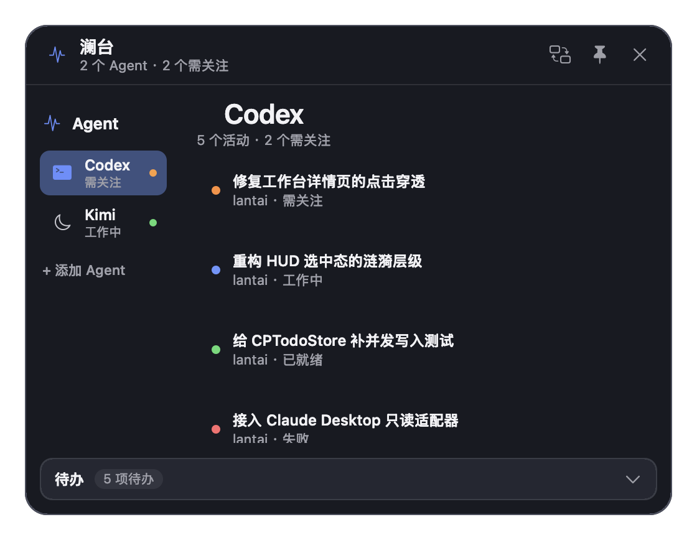
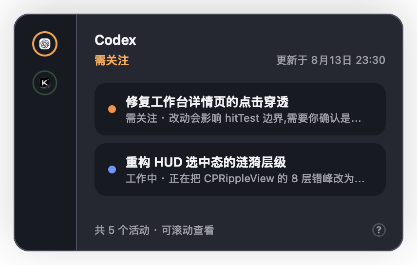
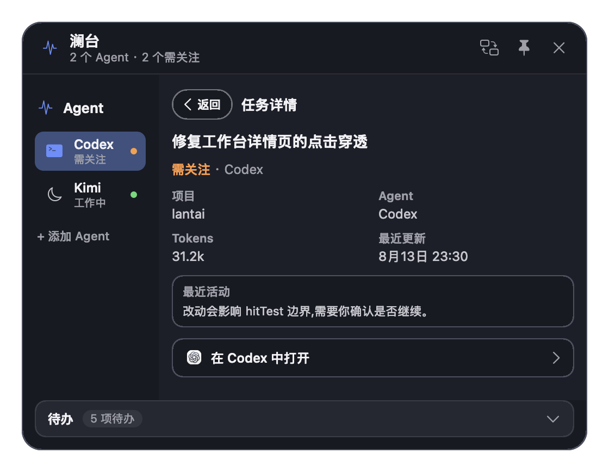

# Lantai / 澜台

A light in your menu bar that tells you whether your local AI agents are done, and which one is waiting on you.

[](https://github.com/wangmingchen3180-crypto/lantai/actions/workflows/build.yml)

[中文](README.md) · [Download](https://github.com/wangmingchen3180-crypto/lantai/releases) · [MIT](LICENSE) · macOS 14+



## The problem

You have Codex Desktop and Kimi open at the same time. You kick off a few tasks and go do something else. Ten minutes later you start wondering: are they finished? Is one of them stuck waiting for me to approve something?

So you tab through every window to check. The more agents you run, the more often you do this, and it produces nothing.

Lantai moves that into the menu bar. One light aggregates every agent's status. When something needs you, expanding it shows exactly which task in which agent, and clicking it jumps straight back to that conversation.

## What it deliberately doesn't do

Lantai is **read-only**. It never launches an agent, proxies your input, approves anything on your behalf, or writes to their data.

That's the design, not an unfinished feature. The common approach is to host agents inside your own terminal, which sees more but requires you to live inside the tool. Lantai inverts that: keep using the native Codex and Kimi apps, and it just watches from the side. If it dies, your agents keep running.

## Four surfaces

Ordered by how much they interrupt you:

| | Purpose |
| --- | --- |
| **Menu bar icon** | One light, the most urgent state across all agents |
| **Floating orb** | Docks to a screen edge; expanding ripples mean something is alive |
| **HUD drawer** | Slides in from the right, one column per agent |
| **Workbench** | Full task list, detail, deep link back, plus a local todo bar |

The HUD drawer gives each agent a column — agents on the left rail, that agent's tasks on the right:



Clicking a task opens its detail rather than jumping away. Confirm it's the one you wanted, then click "open in Codex." The first click only looks; the second one navigates. That keeps a stray click from throwing you out of whatever you were doing:



The ripple isn't decoration. It means "something is alive," and its period is bound to state: 8s when failed, 14s when idle. With macOS Reduce Motion on, everything freezes into a single static status ring.

## Supported agents

| Agent | Reads | Clicking a task | Default |
| --- | --- | --- | --- |
| Codex Desktop | `state_*.sqlite`, `logs_*.sqlite` under `~/.codex/` | Jumps to that exact thread | On |
| Kimi desktop app | Kimi's `conversations.sqlite` and run state | Jumps to that exact chat | On |
| Kimi Code CLI | `~/.kimi-code/sessions/` | Only raises the app; can't return to the terminal | Hidden, opt-in |

Only agents with a **GUI** are eligible. Pure CLI tools (Claude Code CLI, Codex CLI) keep their run state inside a terminal process, invisible unless you host them — and then you're the host, not an observer. To add one, see [docs/AGENT_ADAPTERS.md](docs/AGENT_ADAPTERS.md).

When a data source can't be read, the UI says so explicitly instead of silently rendering "no tasks." Otherwise you can't tell an idle agent from a broken watcher.

## Install

### Download

Grab `Lantai-*-macos.zip` from [Releases](https://github.com/wangmingchen3180-crypto/lantai/releases), unzip, and move it to Applications.

The build is ad-hoc signed and not notarized, so Gatekeeper will quarantine it. Clear that once:

```sh
xattr -dr com.apple.quarantine /Applications/Lantai.app
```

If you'd rather not, build it yourself — local builds carry no quarantine flag.

### Build from source

Requires Xcode Command Line Tools.

```sh
git clone https://github.com/wangmingchen3180-crypto/lantai.git
cd lantai
zsh scripts/build-app.sh
open outputs/Lantai.app
```

It lives in the menu bar and stays out of the Dock.

### Try it without any agent installed

```sh
open -n outputs/Lantai.app --args --demo
```

`--demo` replaces every data source with a fixed set of fictional tasks covering all five display states. It reads none of your local agent files and is exempt from the single-instance check, so it can run alongside a normal instance. The screenshots in this README come from it.

Verify the build:

```sh
"outputs/Lantai.app/Contents/MacOS/CodexPulse" --self-test     # pure logic
"outputs/Lantai.app/Contents/MacOS/CodexPulse" --ui-self-test  # needs a GUI session
```

`scripts/build-app.sh` is the only verified build path. There's a `Package.swift`, but `swift build` fails on some machines over an SDK point-version mismatch.

## Privacy

- SQLite is opened read-only, always
- Never reads cookies, API keys, or session tokens
- Event logs are tailed with a bounded window, never fully loaded
- No network calls at all

Local todos live in `~/Library/Application Support/Codex Pulse/todos.sqlite`. The directory keeps the pre-rename name so existing users don't lose data.

## The name

*Lán* (澜) is a ripple; *tái* (台) is an observation platform. The UI expresses state through ripples, so the name needed water — and it really is a place to watch from, not a control panel.

Eight candidates were checked first: Buoy, Pond, Sonar, Ripple, Crest, Tarn, Lagoon, Guanlan. All taken, four of them squarely inside the AI-agent tooling space — `tenequm/pond` does almost exactly this for Claude Code and Codex CLI sessions. Full trail in [docs/NAMING.md](docs/NAMING.md).

The homophone 兰台 was the Han dynasty imperial archive, and still means "archive" in Chinese — a fitting second reading for a place where records are kept and reviewed.

## Known limitations

- **It depends on undocumented on-disk formats.** Codex and Kimi never promised what their databases look like. A client update can break parsing, and the UI will show an unreadable source. That's inherent to unofficial observers, not a bug in this project. Issues and adapter patches welcome.
- Chinese-only UI right now.
- Not notarized; Gatekeeper will stop you once.
- Only tested on Apple Silicon, macOS 14 and 15.

Personal project, unofficial, unaffiliated with OpenAI or Moonshot. Currently alpha — the internal bundle id and data directory will get a one-time migration later.

## Docs

Everything lives in [docs/](docs/README.md); the index is there. The ones you'll want most:

| | |
| --- | --- |
| [docs/AGENT_ADAPTERS.md](docs/AGENT_ADAPTERS.md) | Writing a read-only adapter |
| [docs/DESIGN.md](docs/DESIGN.md) | Ripple spec, and the icon work still outstanding |
| [docs/UI_ARCHITECTURE.md](docs/UI_ARCHITECTURE.md) | What changing the UI actually costs; skin boundaries |
| [docs/NAMING.md](docs/NAMING.md) | Naming decisions and collision research |
| [docs/BACKLOG.md](docs/BACKLOG.md) | Roadmap |
| [CONTRIBUTING.md](CONTRIBUTING.md) | Contribution constraints |

## License

[MIT](LICENSE)
